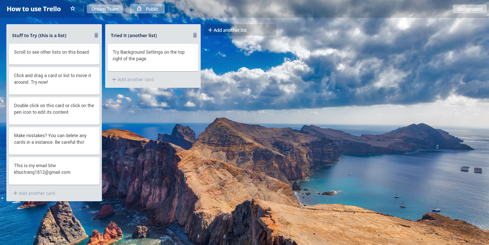

## TRELLO CLONE

Simple create-react-app project utilizing Hacker News API to render news details with feature to toggle themes and layout.



### [View demo](https://khuctrang.github.io/trello-clone/)

### Getting Started

Clone repo, install, cd into folder and run:

```bash
npm install
npm start
```

### Languages & Tools

- [React](https://reactjs.org/) (with Hooks)
- [Redux](https://github.com/reduxjs/redux)
- [redux-persit](https://www.npmjs.com/package/react-persist)
- [CSS3](https://www.w3schools.com/css/)
- [Styled-component](https://www.styled-components.com/)
- [Github Page](https://www.npmjs.com/package/gh-pages) for deployment
